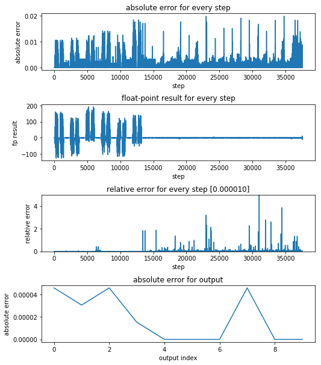

# NPU设计项目
**目的** 在FPGA上面实现一个NPU计算单元。
能够执行矩阵运算（ADD / ADDi / ADDs / MULT / MULTi / DOT等）、图像处理运算（CONV / POOL等）、非线性映射（RELU / TANH / SIGM等）。  
**优点** 考虑到灵活性较强，易于修改网络结构，适用于实现小型CNN/RNN网络。  
**缺陷** 由于指令串行执行、缺少Cache导致外存读写频繁，运算性能较低。  
**联系我们** chenxudong0318@gmail.com

## projects
里面是代码和工程，选用的开发软件平台如下：
> Python 3.6.3  
> Anaconda 5.1.0  
> TensorFlow-gpu 1.3.0  
> Keras 2.1.0  
> Quartus 16.1  
> Modelsim SE 10.4

### · aFPGA
> Intel FPGA的项目工程

### · python
> python的项目工程

## 快速上手步骤
默认配置为 LeNet-5 的CNN网络，可以根据需求进行更改。  
1. 切换目录到 projects\python\keras_cnn\scripts   
2. 如果需要修改网络配置，请根据《python端代码指南.pdf》，配置《网络描述文件.txt》
> ***网络描述文件.txt***  
> I: 32, 32, 1  
> L0: C, 5, 5, 6, tanh  
> L1: S, 2, 2  
> L2: C, 5, 5, 16, tanh  
> L3: S, 2, 2  
> L4: STRIP, 400  
> L5: FC, 400, 120, tanh, dropout  
> L6: FC, 120, 84, tanh, dropout  
> L7: FC, 84, 10, sigmoid  
  
3.依次双击运行下列脚本：
> 0.创建运行环境文件夹.bat  
> 1.运行CNN训练.bat  
> 2.保存CNN模型的参数到csv文件.bat  
> 3.根据csv文件产生NPU指令CNN参数.bat  
> 4.测试CNN & 生成仿真样本.bat

4.切换目录到 projects\aFPGA\05_modelsim  
5.修改 run.do 文件中的 #3 行，修改Quartus的安装目录
> set QUARTUS\_INSTALL\_DIR "E:/intelFPGA/16.1/quartus"  

6.修改 sim_module.bat 脚本 #2 和 #4 行，配置Altera仿真库和Modelsim的路径
> set ALTERA\_SIM\_DIR=E:\modeltech64\_10.4\altera16.1  
> set MTI\_HOME=E:\modeltech64\_10.4  

7.双击 sim_module.bat 脚本，运行仿真  
8.等待仿真结束，在spyder中运行 aFPGA\10\_python\cnn\check\_cnn.py 脚本  
9.观察使用 NPU 运算 CNN的误差
    

